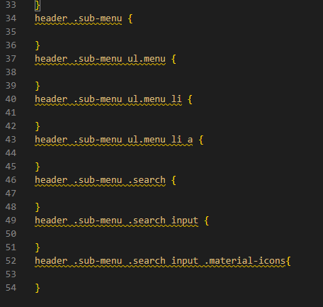

# 스타벅스 크론 코딩 실습

기본적인 아이콘 및 이미지를 가져와서 index 파일 생성. 

1. 별도의 브라우저 아이콘을 설정하지 않았는데, 스타벅스 아이콘으 탭에 뜰 수 있는 이유는:
브라우저는 기본적으로 루트 경로에 있는 favicon.ico 파일이 있으면 해당 파일을 탭의 아이콘으로 사용함.

2. 별도의 png파일같이 고해상도 아이콘을 사용하고 싶은 경우 link 태그를 통해 rel을 icon으로 지정해서 파일 지정하면 된다.

## 오픈 그래프 (The Open Graph protocol)
웹페이지가 소셜 미디어로 공유될 때 우선적으로 활용되는 정보를 지정.


공유되는 링크에 대한 기본적인 메타정보를 요약해서 보여주는 방식.


meta 태그를 이용해서 위와 같은 다양한 정보를 제공할 수 있음.

## 트위터 카드
오픈 그래프와 유사하지만 트위터에서 만든 방식.

오픈그래프나 트위터 카드에 사용하는 SEO이미지를 의미함(구분)


## 브라우저 폰트 설정
Safari의 폰트와 Chrome의 폰트가 다를 것 처럼 브라우저마다 폰트가 다르기에 일관적인 시각성을 위해 직접 폰트 설정을 하면 좋음.


위 이미지와 같이 폰트를 설정하면 개발자 도구 요소 탭에서 직접 화인도 가능하다.

폰트의 경우 저작권과 밀접한 관계가 있기에 유료 폰트로 사용할 경우 주의해서 사용할 것(라이센스 조심)

## Google Material Icons
구글에서 제공하는 기본 아이콘. 별도의 디자인 리소스가 없는 경우 대중적으로 사용하기 매우 유용한 무료 리소스임.

```
<div class="material-icons">
        search
    </div>
```

구글에서 제공하는 아이콘을 사용할 수 있는 링크를 추가한 후 위 코드를 통해 안에 작성하는 명칭에 따라 아이콘을 쉽게 화용할 수 있음. 

## 이미지 태그의 특징


이미지 태그는 기본적으로 인라인 속성을 가지고 있음. 
> 이 인라인 태그는 본질적으로 글자(text)를 다루기 위한 요소이므로 베이스라인 아래 부분에 작은 공백이 생김
> 이미지 태그도 동일한 인라인 요소라서 위 사진처럼 하단에 작은 공백이 생기는 것임.

위 문제를 해결하기 위해 이미지 태그의 css 속성에 display: block; 코드를 추가하면, 이제 이미지 태그를 하나의 글자가 아닌 레이아웃(박스)로 취급하게 됨 => 하단 공백이 사라짐.

## CSS의 배치
position: absolute => 부모 요소의 기준으로 적용.

margin: auto는 top:0, bottom: 0일때 브라우저가 자동으로 해당 상 하단 위치에서 가장 가운데 부분에 요소를 배치시켜줌.
단, 해당 요소의 높이값(height)/너비값(width)이 명시되어 있을 경우임.

## 아직 구현하지 않은 페이지의 경로를 대신해서 href에 넣는 방법
1. href="#" : URL 해시(HASH)라는 개념을 사용 (나ㅑ중에 배움)
2. href="javascript:void(0)" : 자바스크립트의 void(0)이라는 아무 것이 없다는 것을 사용

## CSS의 요소 선택자
header .sub-menu ul.menu 와 같이 계층구조로 특정 요소에만 CSS를 적용하는 방법이 가장 좋음

물론 범용적으로 적용할 style이면 상관없지만, 상위 개념을 빼고 ul.menu와 같은 방식으로 CSS를 작성할 경우 다른 영역의 해당 요소에도 영향을 미치기 때문에 가급적이면 상위 개념에서 내려오는 구조로 작성하는 것이 좋다.
> 해당 부분은 상위 요소를 중복해서 계속 작성하기에 불편하지만, 나중에 SCSS라는 CSS의 전처리에 대한 개념을 배우면 어느정도 해소된다.


> 위 이미지처럼 HTML의 구조를 먼저 CSS에 작성해둔 후 스타일을 작성해 나가면 HTML파일을 왔다갔다 하면서 찾는 번거로움을 줄일 수 있다.

position:absolute을 사용할 경우 해당 요소는 기본적으로 display:block이 적용되기에 따로 명시하지 않아도 무방하다.